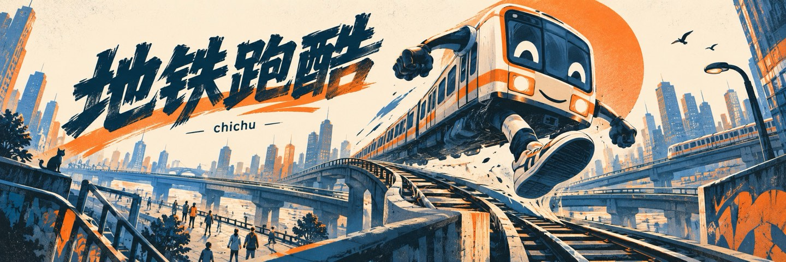

# 地铁跑酷

**[▶ 直接试玩](https://xing0325.github.io/ditie-paoku/)** · 无需登录 · 浏览器运行

别人是在地铁里跑酷，我把句子稍微改了一下：如果是“地铁在跑酷”呢？于是列车成了主角，人反而成了需要面对的障碍。这是从一个语法玩笑长出来的小游戏 demo。

## 30 秒体验

1. 打开试玩页，等待 3D 场景加载。
2. 用方向键左右或 A / D 切换轨道；手机上左右滑动。
3. 观察列车、障碍和碰撞反馈；失败后按键或点击重新开始。

页面依赖外部 Three.js 资源，首次加载受网络影响。它是键盘 / 触屏小游戏，不需要安装客户端。

## 我为什么做它

我喜欢把熟悉的游戏换一个主语，看看体验会不会立刻变得陌生。列车原本是环境的一部分，成为可操作角色后，躲避的意义也跟着改变，还自然联想到电车难题。

## 遇到的问题与取舍

点子能让人会心一笑，但不等于游戏已经成立。我先做出可操作的三轨道 demo，让列车运动、输入与碰撞构成最小体验。更完整的故事、长期关卡设计和“电车难题”如何成为真正的选择，尚未想清楚，也没有在这里假装已经实现。

这次尝试对我的价值，是把一个语言梗变成能亲手玩的东西，再去判断它是否值得继续发展。

## 本地预览

在仓库根目录启动 `python3 -m http.server 4173`，打开 `http://localhost:4173/`。源码从 `index.html` 入口加载；仓库也保留了 `build.mjs` 和单页版本 `play.html`。

---

[刘行 / chichu 的作品集](https://github.com/xing0325) · 封面为 AI 生成概念图，实际功能以项目界面与说明为准。
